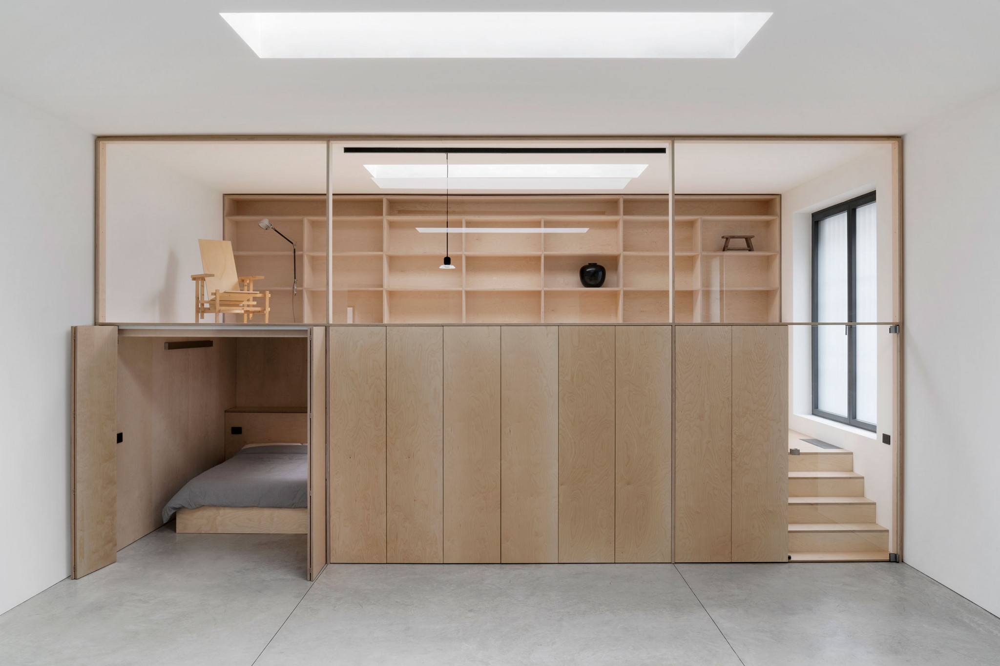

+++
title = "Modular Office Unit"
date = "2023-01-04T13:56:35+01:00"
externalUrl = "https://guglielmopoletti.com/modular-office-unit/"
angry = true
+++

**Update about this link post:**

I originally found a link about this module office unit thing via [swiss-miss.com][], I thought it was super cool, and so I posted the same link here from my site.

Well, a dude at gessato.com sent me a very ugly email, asking me to take this link down. It seems he thinks I am taking credit for building the module office unit, or writing the article about it, or something to that effect, as “a scam.”

Here is what he wrote me:

> Hi Scammer,  
> why are you so full of shit of claiming you wrote this piece -  `https://www.gessato.com/modular-office-unit/`
>
> Take that link down immediately fucking scumbag.

That’s the entire email. It shocked me and [I wrote about it][scammer].

I tried to explain that this is my personal website and it is obvious I did not make [the music video by Little Sims][music-video], or record [the Japanese Pop Album from 1982][pop], or make [the movie trailer for God’s country][trailer] that I linked to, **just like it’s clear I didn’t make this furniture or write anything for gessato.**

[scammer]: https://nathanherald.com/posts/scammer/
[music-video]: https://nathanherald.com/posts/links/little-sims-no-thank-you/
[pop]: https://nathanherald.com/posts/links/takako-mamiya-love-trip/
[trailer]: https://nathanherald.com/posts/links/gods-country-trailer/

Sadly, that didn’t make things better. He replied:

> WHY??  
> because you are a liar. Because your web page  is very deceiving and it makes users believe that you actually WROTE that piece.  
> We take pride in our content and do not tolerate people claiming ownership over it.  
>  Just remove the damn link and move on. 

So, I guess just to be super extra clear to you the reader: **I did not build this office unit, nor do I have anything to do with gessato.com** which should be obvious, but apparently is not. 

_A link from my site does not mean that I endorse the other site, that I work for or created the other site, or that I even know anything at all about the other site. I post blog posts and link posts on “my name dot com”, and so any content you see on “any other name dot com” is obviously unrelated to me. You can even tell which posts here are links by the link emoji (🔗) which has been next to them for years._

The module office unit _was actually_ created by [Guglielmo Poletti][] (who is obviously not me). I found it linked to by [swiss-miss.com][] which is obvisouly not my site (because it’s not “my name dot com”). I sure hope it’s clear that I don’t make furniture, nor write long articles about furniture.

[swiss-miss.com]: https://www.swiss-miss.com/2022/12/gasp-this-modular-space.html
[Guglielmo Poletti]: https://guglielmopoletti.com/modular-office-unit/

You can read below the short sentence I originally wrote about the office unit (which is definitely cool looking), and judge for yourself if I’m taking credit for something I shouldn’t.

- - -

I absolutely love this modular office unit! It includes a work area, tons of storage, a sleeping area, and even an elevated sitting area.


<figure>

</figure>


And then, I originally had linked this post to `www.gessato.com/modular-office-unit` so you could go there and see more about this module office thingie. I do regret linking to them now, for sure.

- - -

_I updated this on 8 Feb 2023._

_I changed the primary link to the website of Guglielmo Poletti, since he actually made the module office unit in question, he has photos of if there if you want to see them, and I don’t think he’ll send me any angry emails about my link to his site._

_I also originally linked to a desk, which was unrelated, but I’m just going to let this now only be about the module office unit thing since it is such a big deal apparently._

_And finally, I also updated my site’s design to not only put a link emoji (🔗) next to link posts, but now put a star emoji (⭐️) next to blog posts. Maybe that will make it even more clear what a link is and what a blog post is. Sheesh._
