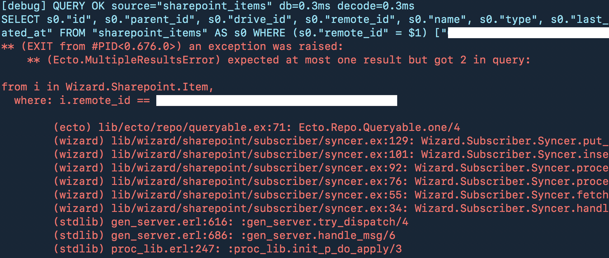

+++
title = "A quick tip to help remember where you left off"
date = "2017-07-28T07:46:34.663Z"
mediumUrl = "https://medium.com/@myobie/a-quick-tip-to-help-remember-where-you-left-off-831ab5da30fa"
+++

If your short-term memory isn’t the best, like me, then you probably have a few tricks to help recall information easier. When I’m programming, working on a spreadsheet, or anything on a computer and I need to leave it in an unfinished state: I will **take a screenshot**. [macOS now supports syncing your Desktop to all your devices](http://www.macworld.com/article/3178609/data-center-cloud/how-to-take-best-advantage-of-icloud-desktop-and-documents-across-macs.html), so that screenshot ends up everywhere automatically.

This morning I noticed a screenshot waiting for me of some code exception. I assume I wanted myself to fix this first-thing today. _After making coffee, of course._ Taking a screenshot, making a note in a notes app, or emailing yourself can really help reconnect you to what you were thinking.

🏁