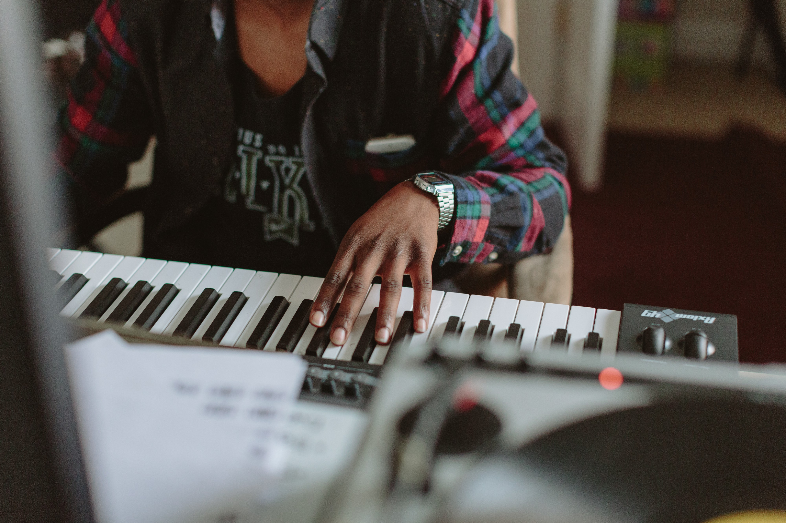

+++
title = "A way to procrastinate"
description = "Get more done, just not right now."
date = "2017-06-22T23:53:43.600Z"
mediumUrl = "https://medium.com/@myobie/a-way-to-procrastinate-b0d8b446e626"
+++

Wasting time is something I fight against all the time. I mean _waste_ in the sense of _having zero value_. However, I also know that **I cannot be productive every hour of every day.** I’ve tried and it’s too exhausting.

Instead, I am always doing around four different side-projects, reading a couple books, watching a few lectures, etc. Having multiple things going on doesn’t mean you lack focus; **focus is being able to prioritize and choose the correct task for right now.**

### Don’t wast time, invest it.

Procrastination is about priorities. Is your current task what you really need to be doing? Is your due-date real or just a trick to motivate yourself? What happens if you don’t finish on time?

I believe we can, and should, invest in ourselves a little everyday if possible. Instead of constantly working, we can learn, read, and rest. Then we can work more effectively when things are pressing and due-dates are real. Sometimes things really do need to get done, and fast, but I believe a lot of people are _busy being busy_ and not because things are truly pressing.

#### Waste

My versions of wasting time are: scrolling twitter for more than 5 minutes, clicking on random youtube videos for no reason, reading political news, watching some old show on netflix…

These things almost never bring me happiness, they are never valuable for me, and I know I’m wasting the time I spend on them. These are the things that consume my time wastefully, yours are almost certain different. I think it pays to know them so you can be more mindful. Being mindful is a super power that will allow you to procrastinate more effectively.

#### Invest

Instead I try to: read a book, take a nap, build something useful, learn more about philosophy, science, or culture… I’ve been trying to get into making music, writing more about myself and my work, and reading. I was never a reader growing up and I’m trying to make up for that time.

Some days the most important decision I make is to wait, rest, and then do work. Instead of always working during normal business hours, I sometimes take the time earlier in the day to do other things and then focus on work in the evening after letting the problems bake a bit. I might spend that day building a new webapp to solve some niche problem I have, design a new logo or a set of icons for an app I want to build, or watch lectures about databases, design, or the history of hip-hop. I consider all of these eventually valuable.

#### Being late

I try not to let people down. I try not to be late on things. But sometimes I end up in a place where I just cannot work more hours, I can’t build more things, I cannot create more stuff without reading, sleeping, or somehow recharging. I’ve overworked myself many times in the past and I’m just not into that anymore. It’s always made things worse.

Let the stakeholders know what’s up, let them know you didn’t plan accordingly, and learn for next time. I’d rather be honest, realistic, and eventually get better at planning.

#### It costs something.

I’ve found that it costs a whole lot to construct a less stressful environment where I can do those things which recharge me. _How can I take time to read a book when I have looming deadlines and I might get fired? When am I going to find the time to hang out with friends, I’ve got all this work to do? I don’t have time to take a nap, I gotta have this report turned in by midnight._

Yes.

There is a cost to prioritizing yourself. Saying “no” always costs something. Instead of imaging it’s always impossible, I recommend working out the realistic costs of these decisions so you can do a cost/benefit analysis for yourself. Don’t work from incomplete assumptions if you don’t have to. Sometimes it does cost too much, but make sure you know that.

### It pays off at work.

_(At least for me.)_

I’ve almost never done something at work for the first time. Instead, I’ve experimented on my own project or built/designed something for myself, then repeated that at work. Even working on the Wunderlist rewrite I ended up just re-typing tons of code that I had typed before, having conversations that I’d already debated with myself, and mostly just implementing ideas that I’d previously worked out.

I like making my mistakes early and in a controlled environment when possible. It’s not always possible: sometimes I gotta do something new right now. Hopefully I’ve invested in myself so I’m rested, aware of what’s possible, what’s easy, and can break the problem down into small enough chunks to attack. When that’s not the case it takes me far longer to be effective at my job.

Reading regularly has been the best decision I’ve made for myself in years, probably ever. Not just because we absorb information from books differently than other mediums, but also because I’ve got a really good excuse to procrastinate when I need it. It’s an enjoyable privilege to be able to take time to read through a book. There have been periods in the past when I didn’t have the time (or the money to make the time) to read and I’m very grateful that I can currently carve that time out for myself.

Good luck. Do your best. And, if you don’t already prioritize it, hopefully you can find some time to invest in yourself soon.

> _All the photos in this post are from_ [_deathtothestockphoto.com_](https://deathtothestockphoto.com)_._