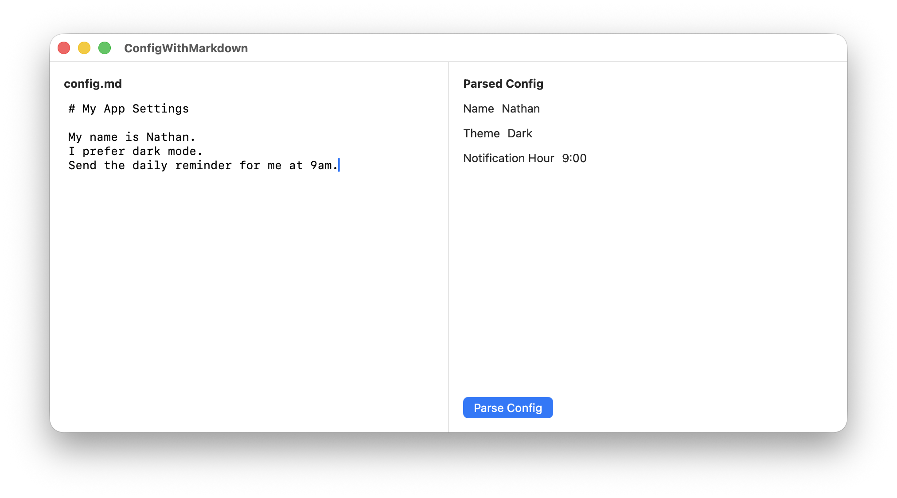

I keep finding little uses for small local SLMs in my side projects, and one that I really like is using Apple's Foundation Model to parse a `config.md` file into an `AppConfig` struct. You could configure your display name, your location, what time you'd like to receive notifications/reminders, the app's theme, and more in plain language.

> SLM == "Small Language Model" which is what I assume Apple's on-device model is. LLMs are the giant ones that run on servers or beefy machines.

Apple's Foundation Models are different from all other SLMs because they are more directly integrated into swift. I don't have to ask the robot to produce json, parse that, see if it is valid, etc. They handle all of that behind the scenes and I receive a valid swift struct or enum.

Here is a little app I made. You can find the project up on [GitHub][repo]. It's just a one file SwiftUI macOS app.



> I can't provide a Playground because playgrounds cannot use macros, so they can't show off the `@Generable` stuff. So it must be a whole ass xcode project. Sorry.

My dream config struct for this app looks like this:

```swift
@Generable
enum Theme: String {
    case light
    case dark
}

@Generable
struct AppConfig: Equatable {
    @Guide(description: "The user's display name if specified")
    var name: String

    @Guide(description: "The user's preferred color theme. Use 'light' for bright backgrounds and dark text, good for daytime or well-lit environments. Use 'dark' for dark backgrounds and light text, easier on the eyes at night or in dim rooms.")
    var theme: Theme

    @Guide(description: "Notification hour in 24-hour format (0-23), or -1 if not specified. Pay attention to AM vs PM and daytime vs evening context.")
    var notificationHour: Int
}
```

_(I wanted to mix in an enum just to show how fancy this can be.)_

`@Guide` is for the SLM to try to help it figure out what these fields are for. This is "prompt engineering" right here. You can see I've tried to _explain_ a bit why one might want light vs dark mode, which hopefully would work for a config file that says something like "I mainly work at night."

This is how you could use Apple's local model to parse some markdown into that struct:

```swift
func parseConfig(markdown: String) async throws -> AppConfig {
    let model = SystemLanguageModel(guardrails: .permissiveContentTransformations)
    let session = LanguageModelSession(model: model)

    let prompt = """
    Extract settings from this config file:

    \(markdown)

    Look for the user's name, theme preference (dark/light mode), and any notification time they've specified.
    """

    let response = try await session.respond(to: prompt, generating: AppConfig.self)
    return response.content
}
```

OK, about the `guardrails`: it's not what you think. The default guardrails are so restrictive that they won't work a majority of the time. With the default guardrails if you ask the SLM to "tell me a joke" it will refuse to do so. And even with `.permissiveContentTransformations` there are still a ton of guardrails on.

**IMHO Apple's models are useless without `.permissiveContentTransformations`.**

The rest of the app is the SwiftUI to make the two pane layout + button. You can view it all on [GitHub][repo].

And you don't have to use Apple's models. At work we've open sourced our code we use to boot up and use on-device MLX SLMs like [Qwen 3][qwen] in our [new.space][] app – our library is called [SHLLM][shllm].

You can also just use [Ollama][] or another local model manager that exposes an HTTP api and use any OpenAI compatible HTTP client package.

Small models can do lots of small, interesting things like this. I am continually looking for more places to use little models to solve little problems. And it's **all on-device,** nothing leaves or goes to any company anywhere, **which is important to me.** More and more I want more things running on my devices when possible.

What ideas do you have for where to use local models? What are some problems you've used small models to solve yourself? Hit me up on [mastodon][] or [threads][].

[repo]: https://github.com/myobie/ConfigWithMarkdown
[shllm]: https://github.com/shareup/shllm
[qwen]: https://huggingface.co/mlx-community/Qwen3-VL-4B-Instruct-4bit
[new.space]: https://new.space
[Ollama]: https://ollama.com
[mastodon]: https://indieweb.social/@myobie
[threads]: https://www.threads.com/@myobie
