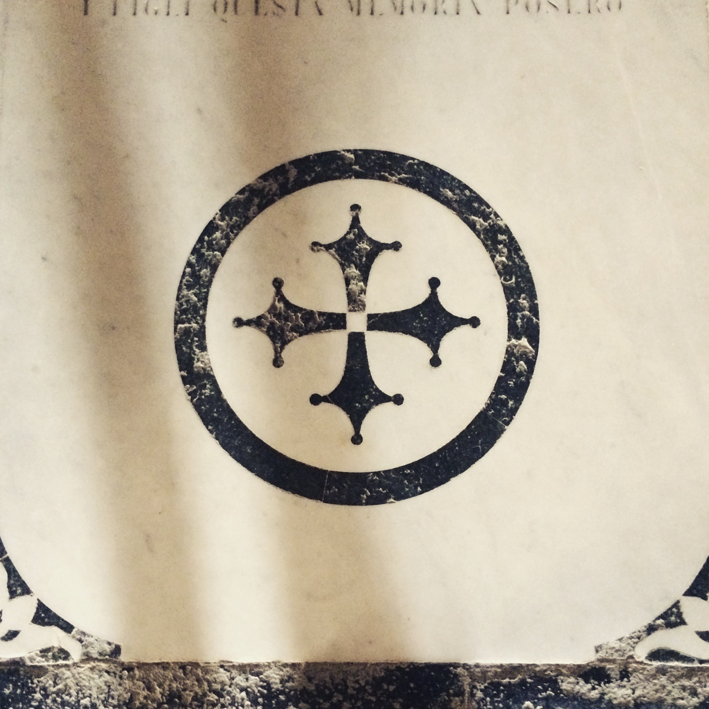
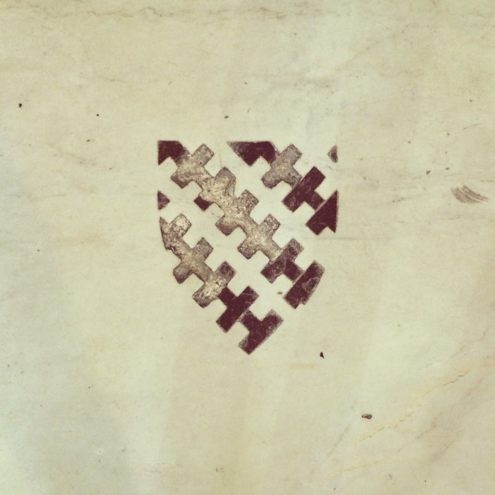

Back in 2015 I visited [San Miniato al Monte](https://en.wikipedia.org/wiki/San_Miniato_al_Monte) in Florence. The church floor is covered in memorial slabs, many of them so worn you can barely read the names and dates anymore, but the inlaid symbols are still bold and sharp.

I immediately recognized this cross:

<figure>

</figure>

That's the [Coudal Partners](https://web.archive.org/web/20210205042901/http://www.coudal.com/about.php) logo. I knew it from watching way too much [Photoshop Tennis](https://web.archive.org/web/20130116073413/http://www.photoshoptennis.com/) back in the day.

I kept walking and found this shield:

<figure>

</figure>

I loved it. Something about it felt right, like it could be my logo.

When I got back home to Berlin I looked up the Coudal Partners story and I couldn't believe it: [Jim Coudal had found his logo in that same church, on a vacation himself](https://web.archive.org/web/20210205042901/http://www.coudal.com/about.php).

I've tried to trace that shield a few times over the years, but it's a complex set of shapes and I never got it to a point where I was happy with it. Recently I decided to try one of those AI services that can draw SVGs from images, [Quiver](https://quiver.ai/), and it nailed it from my photo.

I asked claude code to add the logo to my homepage and to the footer of every page and now I couldn't be happier. Finally I got my shield on my site.
